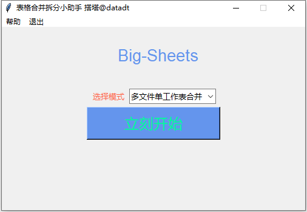

# Big-Sheets(大表哥)	

2018.12.20 基于py-vba开发的表格合并小助手V1.0		

2019.02.11 新增3种拆分功能，共七种合并拆分模式V2.0			

- [x] 多文件单工作表合并		
- [x] 单文件多工作表合并		
- [x] 多文件多工作表合并		
- [x] 多文件指定多表合并		
- [x] 单工作表转多表拆分		
- [x] 多表转多个文件拆分		
- [x] 单表转多个文件拆分			

Tips:		
- 基本操作步骤
0. 下载或克隆项目并解压到文件夹
1. 初始化请保持网络畅通,需配置相关文件;
2. 表格文件的合并或拆分暂时支持xls/xlsx/csv格式;
3. 将要合并拆分的文件放在与该程序同一文件夹下;
4. 下拉选择合并拆分的模式后再点击立刻开始按钮;		
- 功能模块简介
1. 多文件单工作表合并：多个Excel文件合并每个文件的首个工作表到一个新文件中,多文件的工作表名称此处可以不一致；
2. 单文件多工作表合并：一个Excel文件多个工作表合并到一个新文件一个工作表中，需保持各工作表首行字段顺序一致；
3. 多文件多工作表合并：多个Excel文件多工作表智能合并到一个新文件多个工作表中，需保证各文件的工作表顺序一致；
4. 多文件指定多表合并：多个Excel文件多工作表合并指定的工作表到一个新文件多工作表中，弹窗后按要求填写要合并的工作表名称；
5. 单工作表转多表拆分：一或多个单工作表的Excel文件点击按钮按照指定列字段拆分，工作表要拆分的字段下面的值可以乱序；
6. 多表转多个文件拆分：一或多个多工作表的Excel文件按照工作表拆分到每一个独立的新文件中；
7. 单表转多个文件拆分：一或多个单工作表的Excel文件点击按钮按照指定列字段拆分到独立新文件工作表中，其实就是5+6的一键操作模式。

